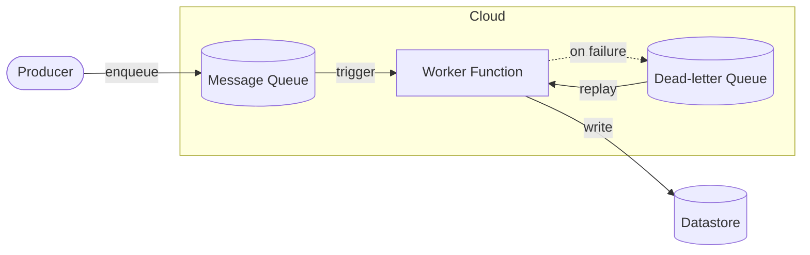
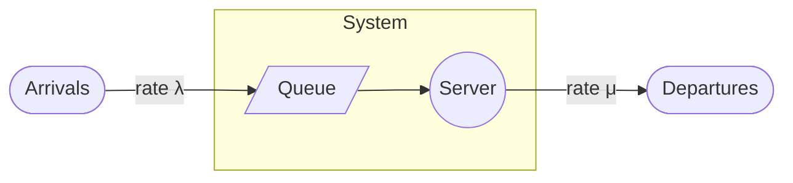

# Serverless Queue

Lorem ipsum dolor sit amet, consectetur adipiscing elit. Sed do eiusmod tempor
incididunt ut labore et dolore magna aliqua. Ut enim ad minim veniam, quis
nostrud exercitation ullamco laboris nisi ut aliquip ex ea commodo consequat.

## The queue in a cloud architecture

Lorem ipsum dolor sit amet, consectetur adipiscing elit. Duis aute irure dolor
in reprehenderit in voluptate velit esse cillum dolore eu fugiat nulla
pariatur. Excepteur sint occaecat cupidatat non proident, sunt in culpa qui
officia deserunt mollit anim id est laborum.

Sed ut perspiciatis unde omnis iste natus error sit voluptatem accusantium
doloremque laudantium, totam rem aperiam, eaque ipsa quae ab illo inventore
veritatis et quasi architecto beatae vitae dicta sunt explicabo.



Nemo enim ipsam voluptatem quia voluptas sit aspernatur aut odit aut fugit, sed
quia consequuntur magni dolores eos qui ratione voluptatem sequi nesciunt.

## The queue as a system

Neque porro quisquam est, qui dolorem ipsum quia dolor sit amet, consectetur,
adipisci velit, sed quia non numquam eius modi tempora incidunt ut labore et
dolore magnam aliquam quaerat voluptatem.

Ut enim ad minima veniam, quis nostrum exercitationem ullam corporis suscipit
laboriosam, nisi ut aliquid ex ea commodi consequatur. Quis autem vel eum iure
reprehenderit qui in ea voluptate velit esse quam nihil molestiae consequatur.



At vero eos et accusamus et iusto odio dignissimos ducimus qui blanditiis
praesentium voluptatum deleniti atque corrupti quos dolores et quas molestias
excepturi sint occaecati cupiditate non provident.

## Keeping the queue stable

Temporibus autem quibusdam et aut officiis debitis aut rerum necessitatibus
saepe eveniet ut et voluptates repudiandae sint et molestiae non recusandae.
Itaque earum rerum hic tenetur a sapiente delectus.

The arrival rate is ${tex`\lambda`} and the service rate is ${tex`\mu`}; their
ratio defines the utilization ${tex`\rho`}:

```tex
\rho = \frac{\lambda}{\mu}
```

Nam libero tempore, cum soluta nobis est eligendi optio cumque nihil impedit
quo minus id quod maxime placeat facere possimus, omnis voluptas assumenda est,
omnis dolor repellendus.

```tex
\rho < 1 \quad \Longleftrightarrow \quad \lambda < \mu
```

Et harum quidem rerum facilis est et expedita distinctio. Nam libero tempore,
cum soluta nobis est eligendi optio. The expected number of items in the system
grows without bound as ${tex`\rho \to 1`}:

```tex
L = \frac{\rho}{1 - \rho}
```

Quis autem vel eum iure reprehenderit qui in ea voluptate velit esse quam nihil
molestiae consequatur, vel illum qui dolorem eum fugiat quo voluptas nulla
pariatur.
